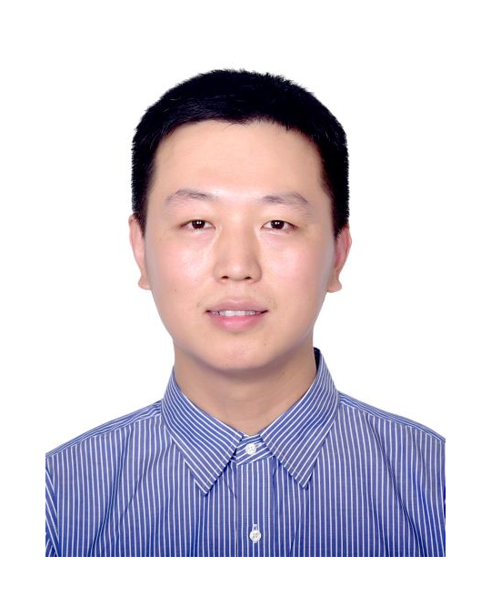

# MY PROFILE

## Short Bio

<!--  -->

李子睿，就读于北京邮电大学集成电路学院，硕士研究生。

本科就读于西安电子科技大学计算机科学与技术专业，期间有一定的计算机体系结构相关学习、实践经历。同时对于数学建模有着丰富经验，并于全国大学生数学建模竞赛以及美国大学生数学竞赛均取得优异成绩。

## Research Interests
Electronic Design Automation; Processor Architecture based on RISC-V; Compiler optimization.

EDA电子设计自动化；RISC-V处理器体系结构；编译优化。

